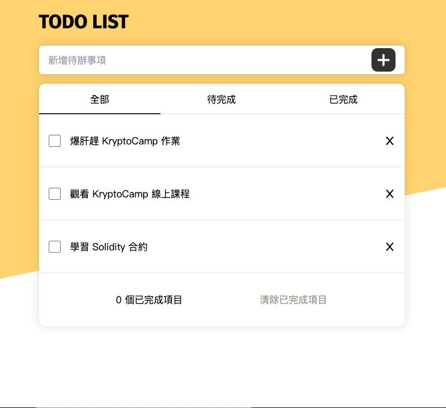

  

  <h3 align="center">Todo List</h3>

  

    🌱 Todo List 待辦事項
     
    ·
    <a href="https://stellular-meringue-602b54.netlify.app/#">線上Demo</a>
  

## 🛖 作業說明

### 基本題
- 使用者可以新增待辦事項
- 使用者可以刪除待辦事項
- 使用者可以將待辦事項設定成已完成
- 將靜態網站 TodoList 部署至 Netlify

### 進階題
- 使用者可以篩選顯示出已完成或未完成的待辦事項
- 清除已完成項目
- 使用者可以儲存所有資料，下次使用時不需要重新輸入
- 可使用瀏覽器提供的 sessionStorage 或 localStorage 完成
  - 當使用者更動 ToDo 資料，將資料更新並存至 storage 裡
  - 當重整畫面，檢查 storage 是否有物件，有物件則取出放到前端畫面上

### 繳交作業
- 作業標題：請填寫你的學號 - 姓名
- 作業網址：請提供部署至 Netilify 網址

### 作業遇到問題？
Discord 發問範例：https://tree-cereal-eee.notion.site/KryptoCamp-Discord-c0d2fa97976849e2bc72b84ffe44f54a 

## 🔨 Built With
此專案會用到的 Library、工具

* [jQuery](https://jquery.com/)
* [tailwindcss](https://tailwindcss.com//)
* [fontawesome](https://fontawesome.com/)
* [Netlify](https://www.netlify.com/)